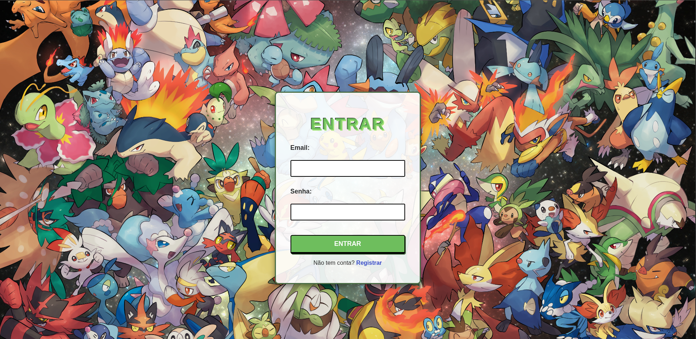
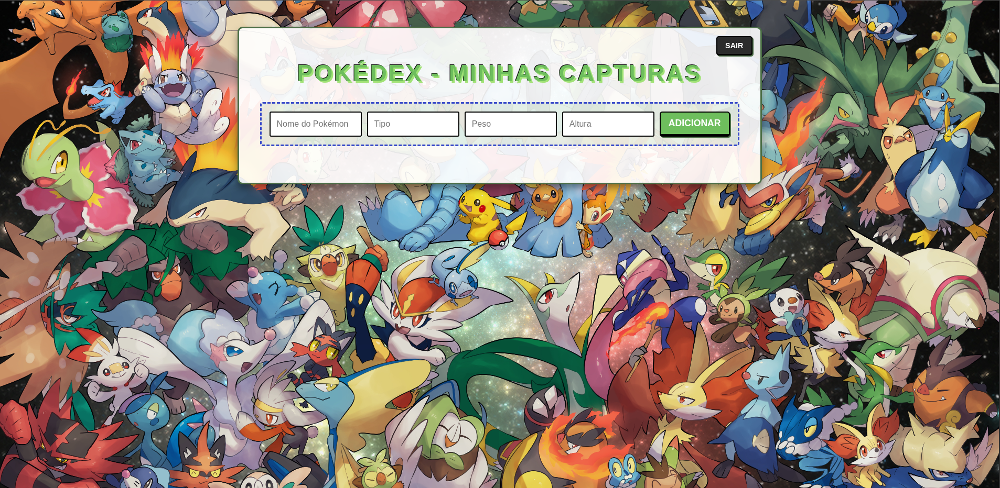

# CRUD Pokedex - Fullstack Java & MongoDB

#### Este é um projeto Fullstack de uma Pokedex, desenvolvido para demonstrar a criação de uma aplicação Web completautilizando Java puro no backend e uma interface moderna no frontend. A aplicação conta com um sistema de autenticaçãoseguro, persistência em banco de dados NoSQL e uma arquitetura organizada em camadas.

## Tecnologias e Ferramentas

### Backend

- Java 17+: Linguagem principal.
- HttpServer (HttpHandler): Servidor nativo do Java para gerenciar requisições HTTP.
- MongoDB: Banco de dados NoSQL para persistência dos usuários e Pokémons.
- BCrypt: Biblioteca para hashing de senhas, garantindo segurança no login.
- Maven: Gerenciador de dependências e build.

### Frontend

- JavaScript (Vanilla): Lógica de integração com a API e manipulação do DOM.
- HTML5 & CSS3: Estrutura e estilização temática com variáveis e design responsivo.

## Estrutura de projeto

    src/main/java/org.pokedex/
    ├── controller/  # Intermediação entre as rotas e a lógica de negócio
    ├── dao/         # Data Access Object (Interação direta com MongoDB)
    ├── database/    # Configuração da conexão com o banco de dados
    ├── model/       # Classes de entidade (Pokedex, User)
    ├── server/      # Configuração do servidor e Handlers de arquivos estáticos
    ├── service/     # Regras de negócio e lógica de autenticação
    └── Main.java    # Ponto de entrada da aplicação
    
    src/main/resources/
    ├── css/         # Estilização da interface
    ├── html/        # Páginas: login.html, register.html, pokedex.html
    ├── img/         # Assets visuais e background
    └── js/          # Lógica frontend (app.js, login.js, register.js)

## Funcionalidades Principais 

### 1. Sistema de usuário

- Registro: Criação de conta com armazenamento seguro de senhas via BCrypt.
- Login: Autenticação de usuários para acesso à Pokedex.

### 2. CRUD de Pokémon

- Visualização da lista de Pokémons cadastrados.
- Adição, edição e remoção de Pokémons diretamente pela interface.

### 3. Persistência Real: 
Todos os dados são salvos em um cluster ou instância local do MongoDB.

### 4. Servidor Estático:
Handler customizado para servir assets (CSS/JS/Imagens) de forma eficiente.

## Configuração e execução

### Pré-requisitos

- Java JDK 17 ou superior.
- Maven instalado.
- Instância do MongoDB ativa (Local ou Atlas).

### Como rodar? 

#### 1. Clone o repositório:

    git clone https://github.com/seu-usuario/crud-pokedex.git

#### 2. Configure a conexão: 
Verifique as credenciais do banco em 

    src/main/java/org.pokedex/database/.

#### 3. Build com Maven

    mvn clean install

#### 4. Execute a aplicação: 
Rode a classe Main.java através da sua IDE ou via terminal.

#### 5. Acesse: 
Abra http://localhost:8080 no seu navegador.

## Demonstração

### Tela de Login

### Pokedex (Dashboard Principal)

### ✍️ Autor
#### Desenvolvido por Luiz Eduardo da Silva Moura.

#### Entre em contato: eduardomoura512@outlook.com

